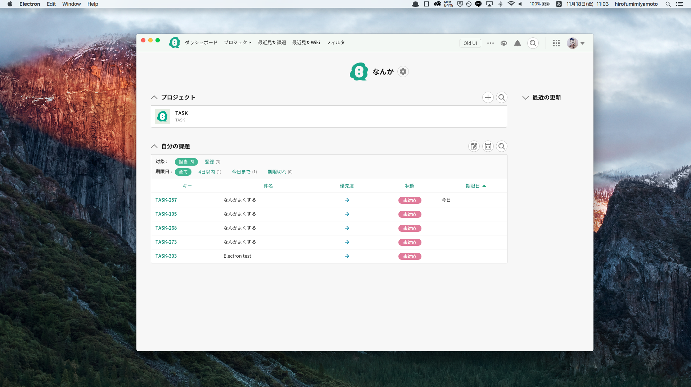

# Spinach

> Unofficial Backlog app

## Install

### macOS

[Download](https://github.com/hrfmmymt/spinach/releases/latest), unzip, and move Spinach.app to the /Applications directory.

### Windows

[Download](https://github.com/hrfmmymt/spinach/releases/latest) and unzip to some location.

### Linux

[Download](https://github.com/hrfmmymt/spinach/releases/latest) and unzip to some location.
