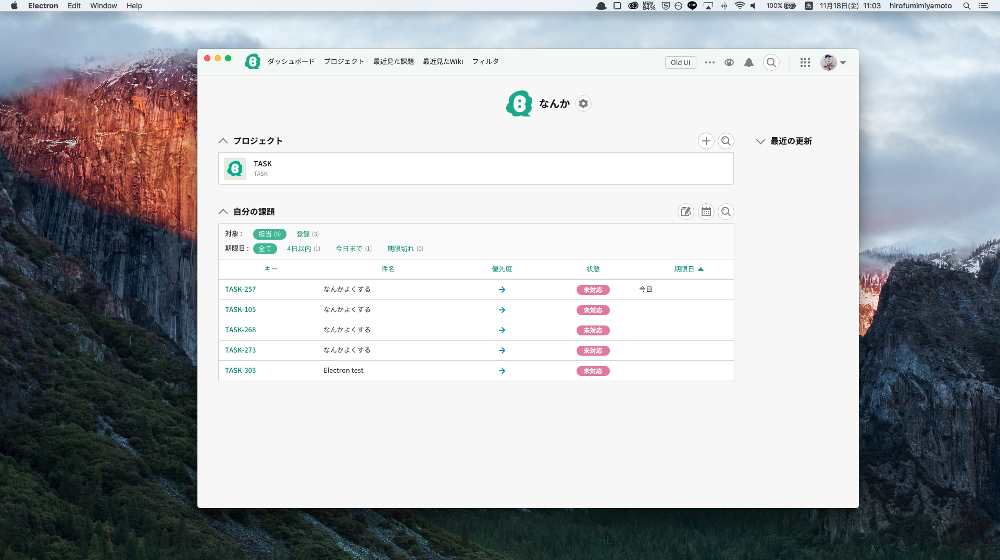

# Spinach

> Unofficial Backlog app

## Install

### macOS

[Download](https://github.com/hrfmmymt/spinach/releases/latest), unzip, and move Spinach.app to the /Applications directory.

### Windows

[Download](https://github.com/hrfmmymt/spinach/releases/latest) and unzip to some location.

### Linux

[Download](https://github.com/hrfmmymt/spinach/releases/latest) and unzip to some location.

## Dev

Built with [Electron](http://electron.atom.io).

###### Commands

- Init: `$ npm install`
- Run: `$ npm start`
- Build macOS: `$ npm run build:macos`
- Build Linux: `$ npm run build:linux`
- Build Windows: `$ npm run build:windows`
- Build all: `$ brew install wine` and `$ npm run build` *(macOS only)*

## License

MIT © [hrfmmymt](http://hrfmmymt.github.io/)
